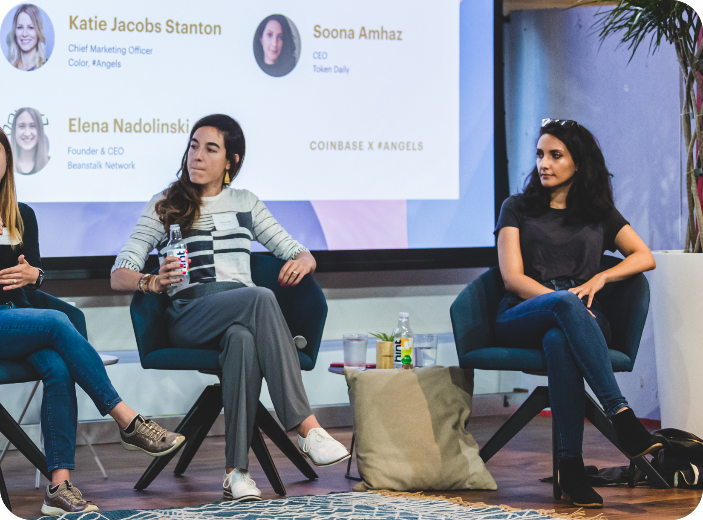

Features
========
WSJ, 2021: [Volt Capital Expects Resurgence of Equity Deals in Crypto](https://www.wsj.com/articles/new-venture-firm-expects-resurgence-of-equity-deals-in-crypto-11619607627)

Bloomberg, 2021: [Soona Amhaz: Focusing on Crypto Equity Companies](https://www.bloomberg.com/news/videos/2021-04-28/focusing-investments-on-crypto-equity-companies-soona-amhaz-video)

CNBC, 2021: [More Crypto Companies to Come, says Soona Amhaz of Coinbase DPO](https://www.cnbc.com/video/2021/04/13/more-crypto-companies-to-come-says-soona-amhaz-of-coinbases-direct-listing.html) 

Forbes, 2021: [30 Under 30 in Venture Capital](https://www.forbes.com/profile/soona-amhaz/)

TechCrunch, 2020: [Magic Launches From Stealth](https://techcrunch.com/2020/06/03/decentralized-identity-management-platform-magic-launches-from-stealth-with-4m/)

Coindesk, 2020: [Cozy Debuts With $2M Funding Round](https://www.coindesk.com/defi-risk-management-startup-cozy-finance-debuts-with-2m-funding-round)

TechCrunch, 2021: [Meet the Entrepreneurs Bringing Bitcoin to Institutions](https://techcrunch.com/2021/02/09/meet-the-entrepreneurs-bringing-bitcoin-to-institutions/)

SXSW, 2019: [State of Crypto Panel](https://schedule.sxsw.com/2019/speakers/2004385)

Axios, 2021: [Volt Capital Raises $10 million to Back Early-Stage Crypto Startups](https://www.axios.com/volt-capital-crypto-startups-8899d0df-b11f-45a0-bbdd-2f4b2b4c46a2.html)

Andreessen Horowitz, 2020: [Crypto Startup School](https://a16z.com/2019/12/11/announcing-crypto-startup-school-instructors/)

Slush, 2019: [Lightning Labs CEO Elizabeth Stark & Volt Capital](https://www.youtube.com/watch?v=h8SdNpRnB-o)

Andreessen Horowitz, 2018: [Crypto Canon - Token Daily](https://a16z.com/2018/02/10/crypto-readings-resources/)

 

 

 State of Crypto Panel with Volt GP Soona Amhaz, GV GP Jessica Verrilli, & Moxxie Ventures GP Katie Jacobs Stanton.
